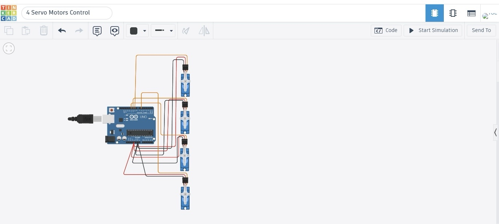
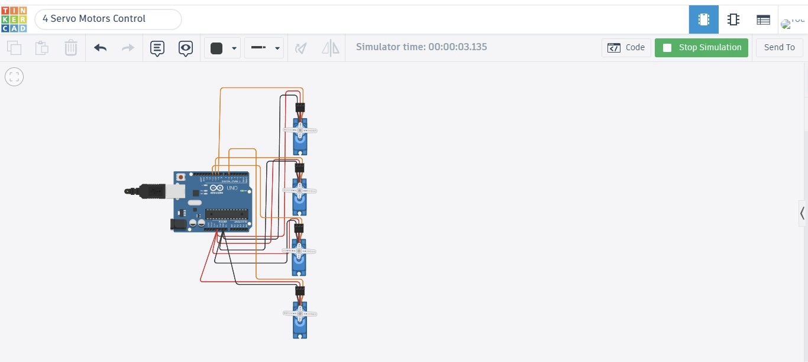

# Servo Motors Sweep Control
## Description
This project demonstrates how to control four servo motors using Arduino. The motors perform the Sweep movement for approximately 2 seconds, then stop and hold at a 90-degree position.
## Components
- Arduino Uno
- 4 Servo Motors
- Jumper Wires
## Files
- `4_Servo_Motors_Control.ino` - Arduino source code.
- `demo.mp4` - Project demonstration video.
- `Images/circuit.png` - Circuit connection.
- `Images/simulation.png` - Simulation result.
## Circuit

## Simulation

## Demo
The project demonstration video is available in this repository as **demo.mp4**.
## Result
The four servo motors perform the Sweep motion for about 2 seconds and then stop at 90 degrees as required.
